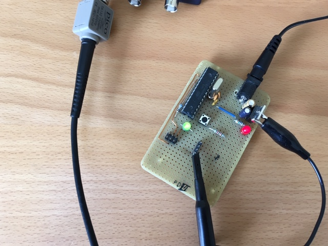
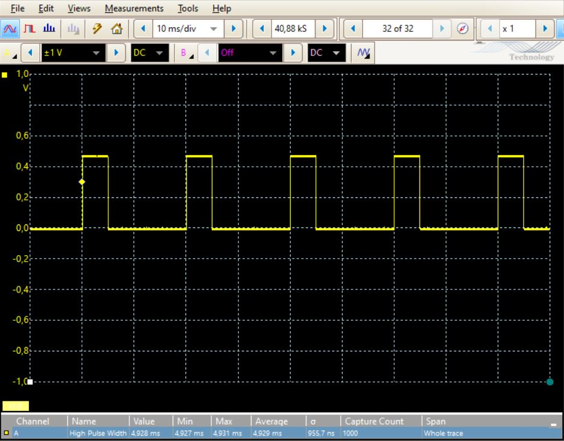

# Example Chapter03_02
## Integer Types Having Fixed Widths and Prime Numbers

<p align="center">
    <a href="https://godbolt.org/z/dPbM7v4ff" alt="godbolt">
        </a>
</p>

Example chapter03_02 focuses on integer types having fixed widths.
The example gets into a fascinating calculation of prime numbers
that is simultaneously intended to emphasize the usefullness
and portability of fixed-width integer types.

## Fixed-Width Integer Types

The code below asserts that
the $664,999^{th}$ prime number is $10,006,721$.

This integer is stored in a fixed width
unsigned integer variable having 32 bits. The storage
is of type `constexpr`, which is compile-time constant.

```cpp
#include <cstdint>

// Initialize the 664,999th prime number.

constexpr auto prime_664999 = static_cast<std::uint32_t>(UINT32_C(10’006’721));
```

The $664,999^{th}$ prime number is, in fact, $10,006,721$.
See also [WolframAlpha](https://www.wolframalpha.com/input?i=Prime%5B664999%5D)
with the input `Prime[664999]`.

Although this example is quite straightforward, it shows that fixed-width
types such as `std::uint32_t` and macros such as `UINT32_C` can
facilitate portability. This is especially true when they are
used consistently throughout the entire code in the project.

## Application Description

In example chapter03_02, the first $100$ prime numbers are calculated
with a sieve method. The sieve-based prime number calculation
is realized within the application task of the software in the
cooperative multitasking scheduler.

We note that the $100^{th}$ prime number is $541$.
This can, for instance, be verified at [WolframAlpha](https://www.wolframalpha.com/input?i=Prime%5B100%5D)
with the input `Prime[100]`.

The example begins by querying the number of entries required
in the sieve to calculate the prime 541. For this, a simple divergent
asymptotic series approximation of the lograithmic integral function is used.
Instead of 100, the approximation returns 108, which is
adequately close to the desired limit and large enough.

Although both the exact number of $100$ primes as well as
the value $541$ of the $100^{th}$
prime are known at the outset,
it is common practice to approximate these before beginning
a sieve calculation of primes. Imagine, for instance, calculating
ten million primes. In this case, it might make sense to first
approximate the upper bound of sieving with the prime counting function
before beginning the sieve iteration.

## Running the Setup

The prime sieve cycle task `void app::prime::task_func()` runs every $50\text{ms}$.
The approximate runtime of each task call required for the
entire sieve calculation of $100$ prime numbers is approximately $5\text{ms}$.

A debug port, in this case `portd.3` is toggled high and low
just prior to and after the call of the prime sieve cacle task.
A straightofrward digital oscilloscope measurement provides
a timing indication for the runtime of the prime sieve cycle task.

A running hardware setup is shown in the picture below.



The runtime of the prime sieve cycle task is depicted below.



## A PC-Based example

A nifty little PC-based sieving program from the code snippets area helps to
[explore prime numbers](../../code_snippets/chapter03/chapter03_02-002a_explore_prime_numbers.cpp).

This code can be run in its entirety at the following
[short link](https://godbolt.org/z/dPbM7v4ff) to [godbolt](https://godbolt.org).

## Prime Counting Function

The prime counting function fascinates mathematicians and
hobbyists alike. In the prime number theorem, under
assumption that the famous Riemann hypothesis is true,
the prime counting function
is related to the logarithmic integral function via

$$\text{Li}(x)-\pi(x)~=~O\left(\sqrt{x}\log{x}\right)\text{,}$$

In other words the ratio

$$\dfrac{\text{Li}(x)}{\pi(x)}~{\sim}~1$$

asymptotically approaches $1$ for large $x$.

Here

$$\text{Li}(x)~=~\text{li}(x)-\text{li}(2)\text{,}$$

and

$$\text{li}(2)\approx{1.045}\ldots~\text{.}$$

See also the
[Wiki article](http://en.wikipedia.org/wiki/Prime-counting_function)
on the _Prime_-_counting_ _function_.

So let's reconsider the $664,999^{th}$ prime number, which is $10,006,721$.
How close is the ratio in the prime number theorem to $1$
at this numerical point?

Consider the following input.

```
N[(LogIntegral[10006721] - LogIntegral[2])/664999, 20]
```

For this input,
[WolframAlpha](https://www.wolframalpha.com/input?i=N%5B%28LogIntegral%5B10006721%5D+-+LogIntegral%5B2%5D%29%2F664999%2C+20%5D)
results in $1.0005042653265034897\ldots$ which is indeed quite close to $1$.
