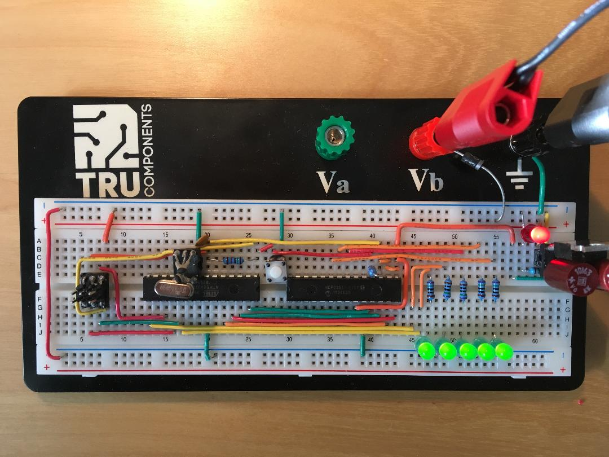

# Example Chapter04_04
# LED Objects and Polymorphism

Example chapter04_04 uses an intuitive LED class hierarchy
to exemplify object oriented design and polymorphism.
In this example, five LEDs in total havind three individual kinds
of port control are toggled in near unison with a frequency
of approximately 1/2Hz.

# LED Classes

The class hierarchy consists of an LED base class called `pwm_base`
from which two LED classes are derived, `led_port` and `led_pwm`.
The port class `led_port` itself uses two kinds of ports,
one microcontroller port and three other ports on an external
serial SPI(TM) port axpander chip of type MICROCHIP(R) MCP23S17.
The PWM based LED is toggled via the dimming of the PWM duty cycle.

# Application Description

The application places five LED base class pointers in an
`std::array` and subsequently toggles them in a range-based
`for`-loop in the application task.

The LED base class pointers, for instance, are shown below.

```
std::array<mcal::led::led_base*, 5U> app_led_base_class_pointers =
{{
  mcal::led::led0(),
  mcal::led::led1(),
  mcal::led::led2(),
  mcal::led::led3(),
  mcal::led::led4()
}};
```

The application task performs the toggle functionality
at a frequency of approximately 1/2Hz using
dynamic polymorphism on the base class pointer list.

```
void app::led::task_func()
{
  if(app_led_timer.timeout())
  {
    app_led_timer.start_interval(app_led_one_sec);

    for(auto& p_led : app_led_base_class_pointers)
    {
      p_led->toggle();
    }

    app_led_state_is_on = (!app_led_state_is_on);
  }
}
```

# Hardware Setup

The five discrete LEDs in this example are fitted and setup
in the following way:

| LED        | Port                        | Details                                                 |
| ---------- | --------------------------- | ------------------------------------------------------- |
| LED0       | microcontroller `portb.5`   | port toggle high / low, 750 Ohm                         |
| LED1       | microcontroller `portb.1`   | Timer A, PWM duty cycle 100% / 0%, 750 Ohm              |
| LED2       | port expander pin `GPA0`    | port toggle high / low, SPI(TM) software drive, 750 Ohm |
| LED3       | port expander pin `GPA1`    | port toggle high / low, SPI(TM) software drive, 750 Ohm |
| LED4       | port expander pin `GPA2`    | port toggle high / low, SPI(TM) software drive, 750 Ohm |


The hardware setup is pictured in the image below.



In this example, we use ports from both the microcontroller as well
as an external port expander chip.

The connections of the port expander chip are tabulated below.

| Port Expander Pin | Expander Function | Connection         |
| ------------- | ---------------- | ----------              |
|    9          | VDD              | +5V                     |
|    10         | VSS              | GND                     |
|    11         | CS (NOT)         | `portc.4`               |
|    12         | SCK              | `portc.3`               |
|    13         | SI               | `portc.1`               |
|    14         | SO               | `portc.2`               |
|    15         | A0               | +5V                     |
|    16         | A1               | +5V                     |
|    17         | A2               | +5V                     |
|    18         | RESET (NOT)      | 15 kOhm to +5V pullup over switch to GND |
|    21         | GPA0             | 750 Ohm to LED2         |
|    22         | GPA1             | 750 Ohm to LED3         |
|    23         | GPA2             | 750 Ohm to LED4         |
