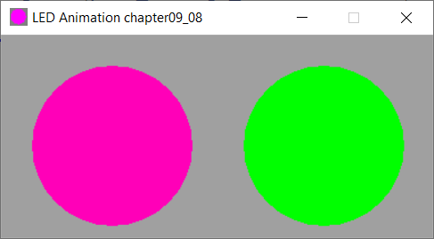

# Example Chapter09_08
# Controlling an RGB LED

Example chapter09_08 utilizes object oriented programming techniques
to control an RGM LED.

# Controlling the RGB LED

Three PWM signals are used to vary the duty cycles of the
red, green and blue hues of an RGB LED in this example.
Current is drawn directly from the microcontroller ports.
The PWM signals are realized entirely in software with
an underlying tick derived from a timer interrupt that
runs every 50 microseconds.

In this example (as in most other examples), both the hardware
version for the target system as well as a simlulated PC
version are available. For this exercise, it was
decided to implement a rather detailed PC simulation
using old-school traditional Win32-API programming.

The Win32-API simulation looks like .

# Application Description

Color hues of RGB blend in a smooth fashion around the entire
spectrum to produce the appearance of slowly varying colors.
The user LED is simultaneously toggled at the usual 1/2Hz.
