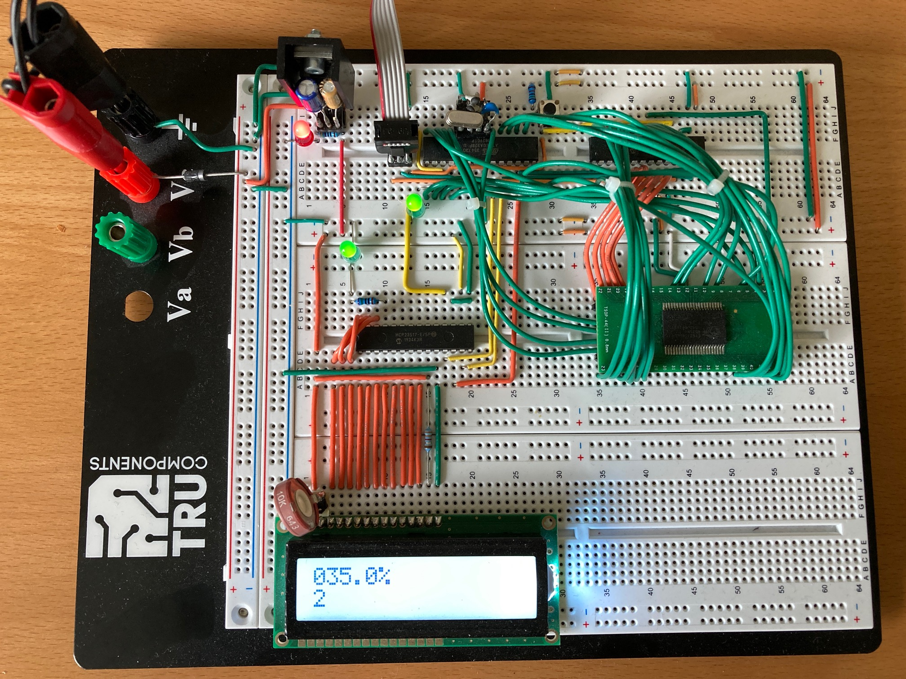

# Example Chapter10_08a
# Parallel SRAM and Computing 100,001 Digits of Pi

This advanced example picks up on the idea of the previous Example Chapter10_08
and extends RAM even further with an external
2MByte asynchronous parallel SRAM brick.
This memory extension expands the range of the Pi Spigot to calculate up to

decimal digits of the mathematical
constant .

This example requires utmost attention to detail and advanced
laboratory and programming skills to make programmatic access
to an external 2MByte parallel SRAM brick as, let's say,
_easy_ _as_ _pie_.

# Application Description

The Pi Spigot program from Example Chapter10_08 is used
in this example in essentially the exact form. The algorithms
and their implementations remain the same.

The difference in this example is the extension to 2MByte
SRAM allowing for the calculation of even more digits of
.

Care needs to be taken to wire the parallel SRAM brick properly
(as shown below). When the hardware setup is correct,
it is relatively straightforward (although definitely
requiring of careful attention to detail) to write a prallel
SRAM driver for the 8-bit MCU. The results of these activities
are expressed in the template classes
`mcal::memroy::sram::memory_sram_parallel_cypress_cy62158e`
and
`mcal::memroy::sram::memory_sram_parallel_cypress_cy62167gn`
found in the files
[mcal_memory_sram_parallel_cypress_cy62158e.h](./src/mcal/avr/mcal_memory_sram_parallel_cypress_cy62158e.h)
and
[mcal_memory_sram_parallel_cypress_cy62158e.h](./src/mcal/avr/mcal_memory_sram_parallel_cypress_cy62167gn.h),
respectively. The former controls a 1 MByte parallel SRAM
brick of type CY62158E
and the latter controls a 2 MByte parallel SRAM
brick of type
CY62167GN, both from Cypress(R), an Infineon Company.

SRAM memory abstractions of specialized iterators and containers,
as shown both in great detail in the book as well as in the previous example,
are employed. These program artifacts abstract memory read/write
operations with the external SRAM bricks to standard C++ template form.
The result is memory access resulting in iterator/container usage
that _looks_ _and_ _feels_ essentially the same as would be expected
from normal iterator/container access within the context of modern C++
programming.

The 1 MByte version can handle

calculations up to and a slightly beyond

decimal digits, whereas the full 2 MByte brick is required for the

digit calculation.

Calculation progress with resolution of

is expressed in directly in alpha-numeric form on an LCD
module of having two-by-sixteen lines.
Armed with all these program elements, the Pi Spigot algorithms
are straightforward and identical with those in the previous example.

The standard _blinky_ LED task is also exercised. In this example,
two LEDs engage in blinking. One is on the usual microcontroller pin
`portb.5`, whereas the second is on one of the port expander pins.
The second LED serves primarily as a simple diagnostic of the
communication between the port expander and the MCU.

As mentioned in the book and in the previous example,
however, the length of the calculation is based on its operation count.
This varies significantly and quadratically with output size.
Although we're not intending to break any records in super-computing
performace with the 8-bit MCU hooked up to external parallel SRAM,
the advantage of parallel port access can be noticed.

Indeed, in this setup, the

decimal digit

calculation takes approximately 60s compared with approximately 90s
in the previous example using serial SRAM chips.
Do, however, be prepared for a bit of a wait as the digit count
in a given Pi Spigot calculation climbs.
The full

requires about 6 days (almost a week) to run on the 8-bit MCU with external
asynchronous parallel SRAM memory.

# Hardware Setup

It is hoped that this example will challenge the microcontroller
laboratory enthusiast and provide for a positive technical experience.
In fact, the wiring of this example is rich in detail and requires attentive
fitting of each wire properly to its dedicated pin(s) on the MCU
or relevant device.

Two port expanders of type
Microchip(R) MCP23S17 are needed to provide enough
digital input/output pins for the necessary
address lines on the SRAM bricks and MCU connections.
These port expanders are controlled with SPI.
Fitting the parallel SRAM brick on a breadboard requires the use
of a secondary SMD-to-DIP adapter to which the SMD device
itself actually needs to be meticulously soldered.

Pinning in this example is summarized in the table below.

TBD

The hardware setup with the 1 MByte SRAM brick
is pictured in the image below.

