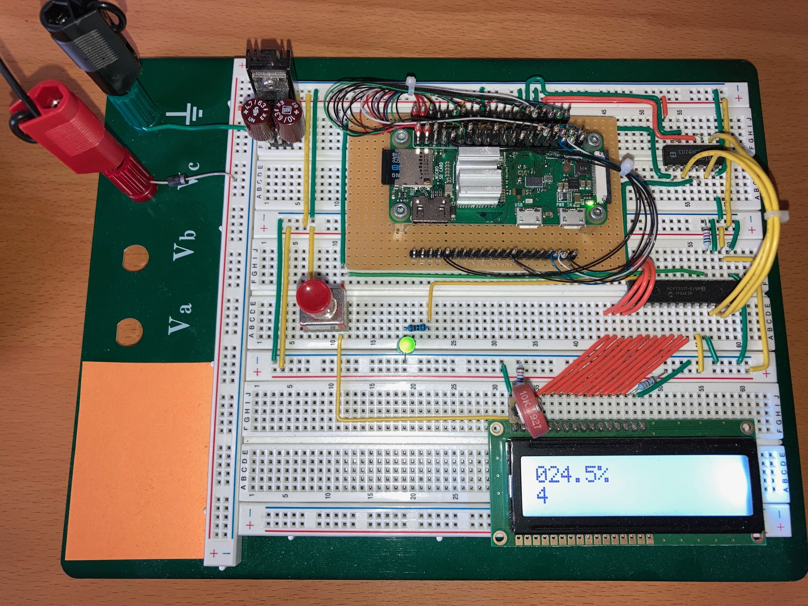

# Example Chapter10_09 (advanced level)
# 100,001 Digits of Pi on Raspberry Pi(R)

This advanced example ports the Pi Spigot
calculation to a powerful 32-bit single-board computer.
The Raspberry Pi(R) Zero WH with Arm1176JZF-S(TM) single core
controller is used.

Using the single-board computer system with its more powerful controller
and ample 512 MByte SRAM simplifies and speeds up the

decimal digit

calculation using the Pi Spigot program.
In particular, tedious wiring and software development efforts required
for our target with the 8-bit microcontroller in previous
Examples Chapter10_08 and 10_08a are drastically reduced
or even entirely eliminated in this example.

# Application Description

The same Pi Spigot algorithm is used yet again
in this example. It can be found in identically the same form
as that which has been used in Examples Chapter10_08 and 10_08a.
The single-board computer is operated
OS-less in _bare-metal_ mode with no input or output device.
Real-time afficionados will relish the eloquent, efficient, terse,
manually-written startup sequence and memory-access optimization code.
A skinny MCAL layer provides the needed peripheral abstractions
for timer, port I/O driver, etc.

The application exercises consecutive, back-to-back

decimal digit

calculations.
Calculation progress is displayed on
an LCD module of type NHD-0216K1Z-FSW-FBW-L-42862
from Newhaven Display International.
It has two-by-sixteen characters and uses standard
industry 8-bit parallel control.

A port expander chip of type
Microchip(R) MCP23S17 provides additional
digital input/output pins for the necessary
connections to the display and a second blinking LED.
A software SPI driver is used to communicate
with the port expander.

In addition to carrying out the Pi Spigot calculation and displaying
calculation progress, the _blinky_ application is executed
in the LED task. Two LEDs engage in blinking.
The first LED is the on-board
GPIO-status-LED fitted on the Raspberry Pi(R) Zero board.
The second LED is manually fitted on the breadboard,
attached over a resistor to one of the port pins on the port expander.

# Booting from SD Card

The Raspberry Pi(R) bootloader is used to boot from the
contents of the micro SD card in the on-board tray upon power-up.
Formatting the SD card is a topic of great interest.
A partition tool or a running `*nix` itself seem to be the
best ways known (reported to work) to format the SD card
in the necessary way. The format characteristics that worked
for this example are FAT32, active primary partition,
non-`Win*` tool used to format.

The bootloader performs its own
pre-programmed initializations. It then loads the contents of
the file `kernel.img` to RAM address `0x00008000`
and subsequently jumps to that address in order
to begin program execution at that point.
It is there, at address `0x00008000`,
where the start of the application
(i.e., the low-level entry point to C-startup)
can be found.

The start of the application is an interrupt vector table,
as shown below.

```cpp
.section .isr_vector, "ax"

b __my_startup
b __int_vect_undef_instr_handler
b __int_vect_sw_interrupt_handler
b __int_vect_prefetch_abort_handler
b __int_vect_data_abort_handler
b __int_vect_unused_05_handler
b __int_vect_irq_handler
b __int_vect_fiq_handler
```

The first entry contains a branch instruction to the
startup routine `__my_startup`, which is shown in its entirety
for reference in the following code sequence.

```cpp
extern "C" void __my_startup(void)
{
  // The ARM1176JZF-S is started in supervisor mode
  // with all interrupts disabled.

  // Setup the stack pointer for the supervisor mode.

  asm volatile("ldr r3, =_svc_stack_top");
  asm volatile("mov sp, r3");

  // Relocate the interrupt vector table.
  asm volatile("ldr r3, =_intvect_base_address");
  asm volatile("mcr p15, 0, r3, c12, c0, 0");

  // Switch to Abort mode and setup the relevant stack pointer.
  asm volatile("cps #0x17");
  asm volatile("ldr r3, =_abt_stack_top");
  asm volatile("mov sp, r3");

  // Switch to Undefined mode and setup the relevant stack pointer.
  asm volatile("cps #0x1b");
  asm volatile("ldr r3, =_und_stack_top");
  asm volatile("mov sp, r3");

  // Switch to IRQ mode and setup the relevant stack pointer.
  asm volatile("cps #0x12");
  asm volatile("ldr r3, =_irq_stack_top");
  asm volatile("mov sp, r3");

  // Switch to FIQ mode and setup the relevant stack pointer.
  asm volatile("cps #0x11");
  asm volatile("ldr r3, =_fiq_stack_top");
  asm volatile("mov sp, r3");

  // Switch to System mode and setup the relevant stack pointer.
  asm volatile("cps #0x1f");
  asm volatile("ldr r3, =_sys_stack_top");
  asm volatile("mov sp, r3");

  // Chip init: Watchdog, port, and oscillator.
  mcal::cpu::init();

  // Initialize statics from ROM to RAM.
  // Zero-clear default-initialized static RAM.
  crt::init_ram();
  mcal::wdg::secure::trigger();

  // Call all ctor initializations.
  crt::init_ctors();
  mcal::wdg::secure::trigger();

  // Jump to main (and never return).
  asm volatile("b main");

  // Catch an unexpected return from main.
  for(;;)
  {
    // Replace with a loud error if desired.
    mcal::wdg::secure::trigger();
  }
}
```

The startup code begins by performing some standard initializations
of stacks, RAM, static constructors, etc.
The program subsequently jumps to `main()`.
The `main()` subroutine is not explicitly shown above.
Once the program arrives in `main()`, it initializes the MCAL,
starts the multitasking scheduler in the usual way,
and never returns. As in the previous Examples
Chapter10_08 and Chapter10_08a,
the Pi Spigot algorithm runs in the idle task
of the multitasking scheduler.

The bare-metal RpiZero startup philosophy employed in this example
will also work for other kinds of programs.
There are, however quite a few details
regarding cache initialization and activating other chip features.
These are partially described in the book's Sect. 10.9 and the references therein.
The bare-metal programming itself (written in a combination of C++ and assembly)
can be seen in its definitive form
in the source code of the low-level initialization files
in the [chip startup](./target/micros/bcm2835_raspi_b/startup)
and [MCAL](./src/mcal/bcm2835_raspi_b).

For a deep dive into the low-level chip init, for instance,
consider the header file
[mcal_cpu_detail_secure.h](./src/mcal/bcm2835_raspi_b/mcal_cpu_detail_secure.h).
This file is written in hybrid C++/assembly and contains
quite a few of the particular chip-specific initialization features.
These are collected in the inline subroutine
`mcal::cpu::detail::init()` which is also sketched below.

```cpp
friend inline void mcal::cpu::detail::init()
{
  initialize_vfp_unit();
  clear_branch_prediction_array();
  fill_tlb_entries();
  enable_mmu();
  enable_branch_prediction();
  enable_caches();
}
```

# SD Card Contents

For exemplary purposes, the entire contents of an RpiZero
SD card for booting and running Example Chapter10_09
are located [here](./target/micros/bcm2835_raspi_b/startup/SD_CARD/PiZero).

`kernel.img` is a raw binary file with no additional storage or address information.
In our particular example, `kernel.img` is, in fact,
the entire application code. It is linked as an absolute program
and located with its program start at `0x00008000`.
The build of Example Chapter10_09 extracts the application file
`kernel.img` with the program `objcopy`.
The other file(s) in the boot image are for standard
RpiZero boot.

# Hardware Setup

The Raspberry Pi(R) Zero WH is used out-of-the-box
without modification.
Old-school wire-wrapping techniques with skinny AWG-30 wires
are used to connect the single-board computer to power, ground
and the necessary logic peripherals. Power and ground lines have
double and quadruple strands of skinny wire
in order to reduce parasitic dissipation
in the currrent-carrying lines.

The logic gate sharpens port output signal edges
and performs the conversion from 3.3V CMOS to 5V TTL.
A hand-sawed, flat-bottomed piece of corrugated aluminum is attached
to the Broadcom(R) chip for cooling.

Pinning in this example is summarized in the table below.

| Port Expander  |  Function    | Connection   |
| -------------- | ------------ | ------------ |
| 1              | GPB_0        | LCD DB_0                                       |
| 2              | GPB_1        | LCD DB_1                                       |
| 3              | GPB_2        | LCD DB_2                                       |
| 4              | GPB_3        | LCD DB_3                                       |
| 5              | GPB_4        | LCD DB_4                                       |
| 6              | GPB_5        | LCD DB_5                                       |
| 7              | GPB_6        | LCD DB_6                                       |
| 8              | GPB_7        | LCD DB_7                                       |
| 9              | V_DD         | +5V                                            |
| 10             | V_SS         | GND                                            |
| 11             | CS           | GPIO16/H36 (via `AND`-gate in 10/9, out 8)     |
| 12             | SCK          | GPIO18/H12 (via `AND`-gate in 1/2, out 3)      |
| 13             | SI           | GPIO19/H35 (via `AND`-gate in 4/5, out 6)      |
| 15             | A_0          | GND                                            |
| 16             | A_1          | +5V                                            |
| 17             | A_2          | GND                                            |
| 18             | RESET        | switch closed (non-pressed): +5V               |
|                |              | switch open (pressed): 16 kOhm pulldown to GND |
| 19-20          | INTA/B       | not connected                                  |
| 21-24          | GPA_0-3      | not connected                                  |
| 25             | GPA_4        | 750 Ohm to LED_1                               |
| 26             | GPA_5        | LCD RS                                         |
| 27             | GPA_6        | LCD R/W                                        |
| 28             | GPA_7        | LCD E                                          |


The hardware setup with the RpiZero in action calculating

decimal digits of
.
is pictured in the image below.


