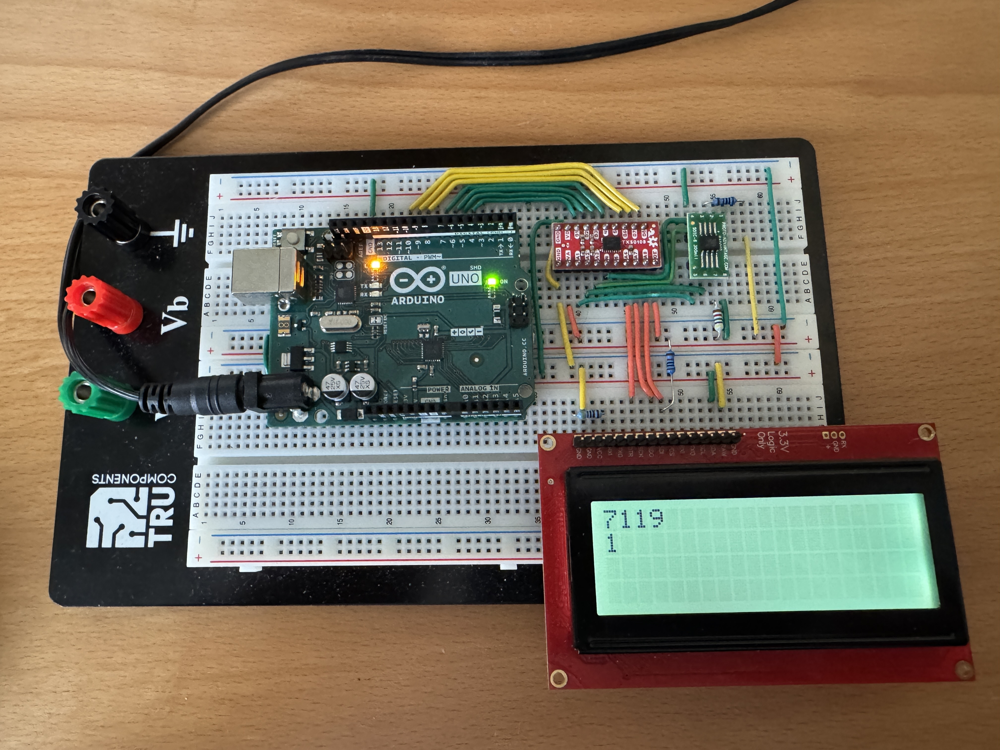

# Example Chapter11_07a (advanced level)
## Preemptive Multitasking Computes 100,001 Digits of Pi in Background Task

This example makes advanced use
of preemptive multitasking scheduling with a highly detailed
and exciting calculation of the mathematical constant $\pi$
to high precision. It uses a spigot-type calculation that is also
combined with a blinky application. The $\pi$ calculation
is performed perpetually and cyclically (and also numerically verified)
in the low-priority background task.

The spigot-type calculation of the mathematical constant $\pi$
in this example is essentially the same calculation as was used in
the previous examples
[chapter10_08](https://github.com/ckormanyos/real-time-cpp/tree/master/examples/chapter10_08),
[chapter10_08a](https://github.com/ckormanyos/real-time-cpp/tree/master/examples/chapter10_08a)
and
[chapter10_09](https://github.com/ckormanyos/real-time-cpp/tree/master/examples/chapter10_09)
(albeit with different hardware setups).

## Application Description

The background task exercises a calculation of many thousands
of digits of the mathematical constant $\pi$.
The spigot-type calculation that was introduced in earlier
examples is used.

The calculations requires considerable amounts of RAM,
much more than is available on our target system with the $8$--bit microcontroller.
For this purpose, a $4~\text{MByte}$ external serial SRAM is used.
This simplifies the breadboard wiring significantly
(compared, for instance, with previo0us examples),
but does require level-shifting
to and from $3.3$_V_ and $5.0$_V_.
Level-shifting is carried out with a specialized
chip designed for this purpose.
An industry-standard display reports the
progress of the running calculation and the number of
completed computations in the current power-on cycle.

## Hardware Setup

An ARDUINO(R) board is used predominantly out-of-the-box,
but it has been adapted with manually soldered-on pins allowing
it to be fitted to the breadboard. The level-shifting is carried out with
an industry-standard level shifter. The $4~\text{MByte}$ serial SRAM
is controlled via an all-software SPI channel.
The LCD display is controlled by a separate independent
all-software SPI channel.

The pin most important pin connections are shown in the tables below.

### SRAM Connections

| SRAM Pin        | Function   | ARDUINO(R) Connection   |
| --------------- | ---------- | ----------------------- |
| 1               | CSN        | portd.7                 |
| 2               | MISO       | portd.6                 |
| 6               | SCK        | portd.5                 |
| 5               | MOSI       | portd.4                 |

### LCD Connections

| LCD        | ARDUINO(R) Connection   |
| ---------- | ----------------------- |
| CSN        | portb.2                 |
| SDI        | portd.1                 |
| SCK        | portd.0                 |

The hardware setup with the $4~\text{MByte}$ serial SRAM
is pictured in the image below. The scene shows the ARDUINO(R)
with the external serial SRAM executing cyclic, back-to-back $10,001$
decimal digit $\pi$ calculations. In this snapshot, one successful
calculation is complete and the second one is well underway.

