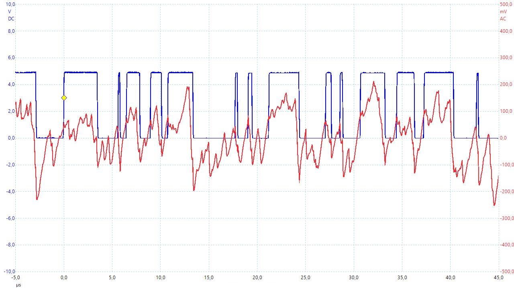

# Example Chapter16_08 (advanced level)
# Generate and Display 128-bit Random Prime Numbers

This advanced example uses a self-made pseudo-random electronic
signal generator combined with an extended integer class
to create 128-bit random unsigned prime integers.
Primality testing is performed via Miller-Rabin.
This example also provides fascinating, intuitive,
visual insight into the prime number theorem
of pure mathematics.

# Application Description

This project uses an elementary electronic subcircuit
to generate a semi-random electrical noise signal.
Bits are collected from the digitized random noise
using a hardware/software random engine
which is architecturally modelled after `std::default_random_engine`.

The bits retrieved from this random engine
are concatenated and used to create 128-bit integers.
These are subsequently tested for primality
in order to identify 128-bit pseudo-prime numbers.
Primality testing uses the well-known Miller-Rabin algorithm.
The [wide-integer](https://github.com/ckormanyos/wide-integer)
project is used to implement 128-bit unsigned integers.

In this example, Miller-Rabin testing has been implemented as a state machine.
The individual states of the prime testing machine are serviced within the
time slices of the multitasking scheduler.
Representation of the 128-bit integers is in hexadecimal format
on an LCD module of type NHD-0440AZ-FL-YBW
from Newhaven Display International. The display
is 40 characters in width by 4 lines and is, in fact,
controlled as two individual displays packed together.

The realease version of this software is intended to run on our target
with the 8-bit microcontroller, as shown below.
On this system, it takes approximately 15s on average
to find each single new pseudo-random 128-bit prime.
This results in finding and displaying about

fresh primes per hour.

Testing runs for this project on the 8-bit target have collected
hundreds of thousands of primes. In addition, in-depth PC-based testing
has confirmed the integrity of the numerical methods
with many, many millions of primes found. These have been independently verified
with separate computer and software algebra system(s).
The default PC configuration built with the VisualStudio(R)
project uses
[Boost.Multiprecision](https://www.boost.org/doc/libs/1_76_0/libs/multiprecision/doc/html/index.html)
for its 128-bit integer representation and independent primality testing.

This advanced example's software running on an 8-bit micrcocontroller
exhibits a fascinating combination of elementary electronics,
real-time C++ object-oriented and template programming,
and the inate elegance and beauty of pure mathematics.

# Hardware Setup

Our target with the 8-bit microcontroller is used in this example.
The random engine is implemented in software as an adapted
partial SPI driver. The SPI timing has been adjusted to match
the approximate frequency of the random bits in the input bit stream.
The SPI input pin is `portc.5`, on which
random bits are collected and directly collated into 128-bit prime candidates.

The target hardware is shown in the image below.
The random noise subcircuit can be observed in the central right portion
of the breadboard. The 12V supply (center left) stems from a classic LM7812
voltage regulator, from which TTL +5V (upper left) is also derived for
the MCU and logic power rail.

In this particular image,
the system has accumulated a few hundred pseudo-random prime
128-bit integers, with the most recent prime shown on the display.
On average, approximately 23.4 trials (of prime candidates)
have been tested for primality per found prime, in accordance
with the prime number theorem.

The electronic subcircuit used for creating the random digitized noise
is sketched below.

The oscilloscope image below shows a small snapshot
of the random digitized noise from this circuit.

# Deep Connection to the Prime Number Theorem

Recal the prime counting function
previously encountered in Example Chapter03_02
[here](https://github.com/ckormanyos/real-time-cpp/tree/master/examples/chapter03_02#prime-counting-function).
The prime number theorem known from mathematical number theory
postulates that the prime counting function

for large 
asymptotically and approximately approaches

.

This assertion basically means that
for large 
the density of prime numbers is close to
.
Consider 128-bit unsigned integers having numerical value around
.
The probability that a randomly chosen 128-bit unsigned integer is prime is about
,
or a bit in excess of one percent.

Numbers having trailing base-10 digit equal to one of 0, 2, 4, 5, 6 or 8
are obviously non-prime. These have been rejected via software
from the random device in example chapter16_08.
Furthermore, prime candidates having base-10 digital root
equal to 3, 6 or 9 have also been eliminated from prime consideration.

This selective digital filtering in the software of Example Chapter16_08
increases the odds that a randomly chosen
128-bit integer is prime. With selective digital filtering implemented within
the bit-collection software, in fact,
the odds that a randomly chosen, selectively filtered
128-bit integer is prime increase to slightly higher than

,

or around four percent. Sect. 16.8 in the book runs through
the related, intriguing mathematics in great detail.

Example Chapter16_08 accumulates many prime numbers
selected randomly from prime candidates originating from the random bits
collected from the generator circuit.
A running average representing the number of prime candidates
that have been tested per prime number found is stored
and displayed in realtime. The value of this running average
verifies the prime number theorem in a very intuitive way.
