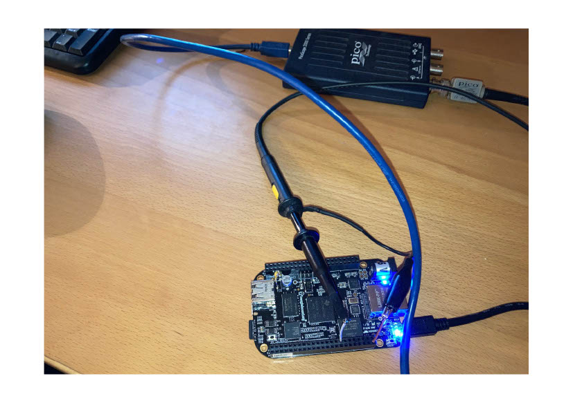

Real-Time-C++
==================

<p align="center">
    <a href="https://github.com/ckormanyos/real-time-cpp/actions">
        </a>
    <a href="https://github.com/ckormanyos/real-time-cpp/actions">
        </a>
    <a href="https://github.com/ckormanyos/real-time-cpp/actions">
        </a>
    <a href="https://github.com/ckormanyos/real-time-cpp/actions">
        </a>
    <a href="https://github.com/ckormanyos/real-time-cpp/issues?q=is%3Aissue+is%3Aopen+sort%3Aupdated-desc">
        </a>
    <a href="https://github.com/ckormanyos/real-time-cpp/actions/workflows/codeql.yml">
        </a>
    <a href="https://scan.coverity.com/projects/ckormanyos-real-time-cpp">
        </a>
    <a href="https://sonarcloud.io/summary/new_code?id=ckormanyos_real-time-cpp">
        </a>
    <a href="https://github.com/ckormanyos/real-time-cpp/blob/master/LICENSE_1_0.txt">
        </a>
</p>

This repository provides companion code for the book C.M. Kormanyos, _Real-Time_ _C++:_
_Efficient_ _Object-Oriented_ _and_ _Template_ _Microcontroller_ _Programming_, _4_$^{th}$ _Edition_
and is made available for educational and exploratory use.

The repository has several main parts.
  - Reference Application `ref_app` located in [ref_app](./ref_app). This also includes the [benchmarks](./ref_app/src/app/benchmark).
  - [Examples](./examples) from the book
  - [Code Snippets](./code_snippets) from the book

GNU/GCC cross compilers and various additional tools
running on `Win*`, optionally needed for certain builds
as described below, can be found in the related
[ckormanyos/real-time-cpp-toolchains](https://github.com/ckormanyos/real-time-cpp-toolchains)
repository.

## Details on the Reference Application

The reference application boots with a small startup code and subsequently
initializes a skinny microcontroller abstraction layer (MCAL). Control is
then passed to a simple multitasking scheduler that manages the
LED application, calls a cyclic benchmark task and services the watchdog.

The LED application toggles a user-LED with a frequency of $\frac{1}{2}~\text{Hz}$
The result is LED on for one second, LED off for one second.
The LED application runs cyclically and perpetually
without break or pause.

The reference application is compatible with C++14, 17, 20, 23 and beyond.

## Portability

The application software is implemented once and used uniformly
on each supported target in the [ref_app](./ref_app).
Differences among the individual targets arise only
in the lower software layers pertaining
to chip-specific and board-specific startup/MCAL details.

In this way the project exhibits a high level of portability.

## Supported Targets in the Reference Application

The reference application supports the following targets (in alpha-numeric order):

| Target name (as used in build command) | Target Description                                          | *(breadboard) |
| -------------------------------------- | ----------------------------------------------------------- | ------------- |
| `am335x`                               | BeagleBone with Texas Instruments(R) AM335x ARM(R) A8       |               |
| `am6254_soc`                           | PocketBeagle2 with multicore Texas Instruments(R) AM6254    |               |
| `atmega2560`                           | MICROCHIP(R) [former ATMEL(R)] AVR(R) ATmega2560            |               |
| `atmega4809`                           | MICROCHIP(R) [former ATMEL(R)] AVR(R) ATmegax4809           | X             |
| `avr` (as used in the book)            | MICROCHIP(R) [former ATMEL(R)] AVR(R) ATmega328P            | X             |
| `bcm2835_raspi_b`                      | RaspberryPi(R) Zero with ARM1176-JZFS(TM)                   | X             |
| `bl602_sifive_e24_riscv`               | BL602 single-core RISC-V (SiFive E24)                       | X             |
| `Debug`/`Release`                      | PC on `Win*` via MSVC x64 compiler `Debug`/`Release`        |               |
| `host`                                 | PC/Workstation on `Win*`/`mingw64`/`*nix` via host compiler |               |
| `lpc11c24`                             | NXP(R) OM13093 LPC11C24 board ARM(R) Cortex(R)-M0+          |               |
| `nxp_imxrt1062`                        | Teensy 4.0 Board / NXP(R) iMXRT1062 ARM(R) Cortex(R)-M7     | X             |
| `riscvfe310`                           | SiFive RISC-V FE310 SoC                                     |               |
| `rl78`                                 | Renesas(R) RL78/G13                                         |               |
| `rpi_pico_rp2040`                      | RaspberryPi(R) Pico RP2040 with dual ARM(R) Cortex(R)-M0+   | X             |
| `rpi_pico2_rp2350`                     | RaspberryPi(R) Pico2 RP2350 with dual ARM(R) Cortex(R)-M33  | X             |
| `rx63n`                                | Renesas(R) RX630/RX631                                      |               |
| `stm32f100`                            | STMicroelectronics(R) STM32F100 ARM(R) Cortex(R)-M3         | X             |
| `stm32f407`                            | STMicroelectronics(R) STM32F407 ARM(R) Cortex(R)-M4F        |               |
| `stm32f429`                            | STMicroelectronics(R) STM32F429 ARM(R) Cortex(R)-M4F        |               |
| `stm32f446`                            | STMicroelectronics(R) STM32F446 ARM(R) Cortex(R)-M4F        |               |
| `stm32h7a3`                            | STMicroelectronics(R) STM32H7A3 ARM(R) Cortex(R)-M7         |               |
| `stm32l100c`                           | STMicroelectronics(R) STM32L100 ARM(R) Cortex(R)-M3         | X             |
| `stm32l152`                            | STMicroelectronics(R) STM32L152 ARM(R) Cortex(R)-M3         |               |
| `stm32l432`                            | STMicroelectronics(R) STM32L432 ARM(R) Cortex(R)-M4F        | X             |
| `v850es_fx2`                           | Renesas(R) Electronics V850es/Fx2 upd703231                 |               |
| `wch_ch32v307`                         | WCH CH32v307 RISC-V board                                   |               |
| `wch_ch32v307_llvm`                    | WCH CH32v307 RISC-V board (but using an LLVM toolchain)     |               |
| `x86_64-w64-mingw32`                   | PC on `Win*`/`mingw64` via GNU/GCC x86_x64 compiler         |               |
| `xtensa_esp32_s3`                      | Espressif (XTENSA) NodeMCU ESP32-S3                         | X             |
| `xtensa32`                             | Espressif (XTENSA) NodeMCU ESP32                            | X             |

In this table, *(breadboard) means the board (or certain versions of it) can be readily
used with a common breadboard. This may possibly need some very straightforward
manual soldering/mounting of header-pins.

## Getting Started with the Reference Application

It is easiest to get started with the reference application using one of the
supported boards, such as `avr` (ARDUINO) or `bcm2835_raspi_b`
(RaspberryPi ZERO) or `am335x` (BeagleBoneBlack), etc.
The reference application can be found
in the directory [ref_app](./ref_app) and its
subdirectories.

The reference application uses cross-development and
build systems are supported on:
  - `*nix` make tools in combination with Bash/GNUmake (bash script) on LINUX/MacOS,
  - ported `*nix`-like make tools on `Win*` in combination with batch script or Microsoft(R) Visual Studio(R) via _External Makefile_,
  - MICROCHIP(R) [former ATMEL(R)] Studio on `Win*`,
  - or platform-independent CMake.

Upon successful completion of the build,
the resulting artifacts including HEX-files
(such as `ref_app.hex`), map files, size reports, etc.,
are available in the `bin` directory.

### Build with Bash Shell Script and GNU make

To get started with the reference application on `*nix`
  - Open a terminal in the directory  [ref_app](./ref_app).
  - The terminal should be located directly in [ref_app](./ref_app) for the paths to work out (be found by the upcoming build).
  - Identify the Bash shell script [ref_app/target/build/build.sh](./ref_app/target/build/build.sh).
  - Consider which configuration (such as `target avr`) you would like to build.
  - Execute `build.sh` with the command: `./target/build/build.sh avr rebuild`.
  - This shell script calls GNU make with parameters `avr rebuild` which subsequently rebuilds the entire solution for `target avr`.
  - If you're missing AVR GCC tools and need to get them on `*nix`, run `sudo apt install gcc-avr avr-libc`.

### Example Build on `*nix` for `target avr`

We will now exemplify how to build the reference application on a command shell
in `*nix` for `target avr`. This target system includes essentially
_any_ ARDUINO(R)-compatible board. This is also the board compatibility
actually used with the homemade boards in the book.

Install `gcc-avr` if needed.

```sh
sudo apt install gcc-avr avr-libc
```

Clone or get the [ckormanyos/real-time-cpp](https://github.com/ckormanyos/real-time-cpp)
repository. Then build with:

```sh
cd real-time-cpp
cd ref_app
./target/build/build.sh avr rebuild
```

### Example Build on `*nix` for `target stm32f446`

We will now exemplify how to build the reference application on a command shell
in `*nix` for an ARM(R) target. Consider, for example, the build variant
`target stm32f446`. The NUCLEO-F446RE board from STMicroelectronics(R)
can conveniently be used for this.

Install `gcc-arm-none-eabi` if needed.

```sh
sudo apt install gcc-arm-none-eabi
```

Clone or get the [ckormanyos/real-time-cpp](https://github.com/ckormanyos/real-time-cpp)
repository. Then build with:

```sh
cd real-time-cpp
cd ref_app
./target/build/build.sh stm32f446 rebuild
```

### Example Build on MacOS for `target stm32f446`

We will now exemplify how to build the reference application in a command shell
in MacOS for an ARM(R) target. Consider, for example, the build variant
`target stm32f446`. The NUCLEO-F446RE board from STMicroelectronics(R)
can conveniently be used for this.

Clone or get the [ckormanyos/real-time-cpp](https://github.com/ckormanyos/real-time-cpp)
repository.

The default version 3.81 of GNUmake on MacOS can (now) be used.
The make files used in this repository have been made
compatible with it. For background information, see also
[issue 273](https://github.com/ckormanyos/real-time-cpp/issues/273).

Build the target with a direct manual call to `make`.

```sh
cd real-time-cpp
cd ref_app
make -f target/app/make/app_make.gmk rebuild TGT=stm32f446
```

If the toolchain is needed then it must be installed or retrieved
prior to building the target of the reference application.

You can obtain via `wget` (or optionally install)
the `gcc-arm-none-eabi` toolchain if needed.
In this case, I have found it convenient to use
a modern `gcc-arm-none-eabi` for MacOS which can be found at
[Arm GNU Toolchain Downloads](https://developer.arm.com/tools-and-software/open-source-software/developer-tools/gnu-toolchain/downloads).

The `arm-non-eabi` toolchain can be fetched via `wget`
and successfully used locally in the shell. If this is desired,
follow the step-by-step procedure below.

Step 1: Make a local directory (such as `macos-gnu-arm-toolchain`) and `cd` into it.

```sh
cd real-time-cpp
mkdir -p macos-gnu-arm-toolchain
cd macos-gnu-arm-toolchain
```

Step 2: Fetch the toolchain's tarball with `wget`, unpack it
and add the compiler's `bin`-directory to the shell's executable path.

```sh
wget --no-check-certificate https://developer.arm.com/-/media/Files/downloads/gnu/12.2.rel1/binrel/arm-gnu-toolchain-12.2.rel1-darwin-x86_64-arm-none-eabi.tar.xz
tar -xvf arm-gnu-toolchain-12.2.rel1-darwin-x86_64-arm-none-eabi.tar.xz
PATH=$(pwd)/arm-gnu-toolchain-12.2.rel1-darwin-x86_64-arm-none-eabi/bin:$PATH
```

Step 3: Optionally `echo` the `PATH` for a quick path-check.
It can also be helpful to query `arm-non-eabi-g++`'s version.
This is expected to verify that the toolchain is correctly added
to this shell's local `PATH`.

```sh
echo $PATH
arm-none-eabi-g++ -v
```

Now simply use the commands to build the target
with a direct call to `make` (which is the same
as shown above for the `*nix` case).

```sh
cd real-time-cpp
cd ref_app
make -f target/app/make/app_make.gmk rebuild TGT=stm32f446
```

### Build with VisualStudio(R) Project and CMD Batch

To get started with the reference application on `Win*`
  - Clone or get the [ckormanyos/real-time-cpp](https://github.com/ckormanyos/real-time-cpp) repository.
  - Get and setup (from the [ckormanyos/real-time-cpp-toolchains](https://github.com/ckormanyos/real-time-cpp-toolchains) repository) any needed GNU/GCC cross compilers running on `Win*`, as described in detail a few paragraphs below.
  - Start Visual Studio(R) 2019 (or later, Community Edition is OK)
  - Open the solution `ref_app.sln` in the [ref_app](./ref_app) directory.
  - Select the desired configuration.
  - Then rebuild the entire solution.

The `ref_app` build in Microsoft(R) VisualStudio(R)
makes heavy use of cross development using a project
workspace of type _External_ _Makefile_.
GNUmake is invoked via batch file in the build process.
It subsequently runs in combination with several Makefiles.

To build any `ref_app` target other than `Debug` or `Release` for Win32, a cross-compiler
(GNU/GCC cross compiler) is required. See the text below for additional details.

GNU/GCC cross compilers running on `Win*` intended
for the reference application on VisualStudio(R)
can be found in the _toolchains_ repository,
[ckormanyos/real-time-cpp-toolchains](https://github.com/ckormanyos/real-time-cpp-toolchains).
The _toolchains_ repository contains detailed instructions on
installing, moving and using these ported GNU/GCC compilers.

Note on GNUmake for `Win*`: A GNUmake capable of being used on `Win*`
can be found in the
[ckormanyos/make-4.2.1-msvc-build](https://github.com/ckormanyos/make-4.2.1-msvc-build)
repository.
If desired, clone or get the code of this repository.
Build `make-4.2.1` in its `x64` `Release` configuration
with MSVC (i.e., VC 14.2 or later, Community Edition is OK).

### Build with Cross-Environment CMake

Cross-Environment CMake can build the reference application.
For this purpose, CMake files have also been created for each supported target.

Consider, for instance, building the reference application for the
`avr` target with CMake. The pattern is shown below.

```sh
cd real-time-cpp
mkdir build
cd build
cmake ../ref_app -DTRIPLE=avr -DTARGET=avr -DCMAKE_TOOLCHAIN_FILE=../ref_app/cmake/gcc-toolchain.cmake
make -j ref_app
```

We will now consider, for instance, building the reference application for
one of the supported ARM(R) targets with CMake. The pattern is shown below.
In this case, we need to identify the following make options:

```sh
-DTRIPLE=avr -DTARGET=avr
```

Switch these options to the ones intended for the `stm32f446` ARM(R)-based target being built.

```sh
-DTRIPLE=arm-none-eabi -DTARGET=stm32f446
```

Let's clarify the commands in their entirety in order to run a CMake build for `stm32f446`
(i.e., ST Microelectronics(R) STM32F446 ARM(R) featuring Cortex(R)-M4F).

```sh
cd real-time-cpp
mkdir build
cd build
cmake ../ref_app -DTRIPLE=arm-none-eabi -DTARGET=stm32f446 -DCMAKE_TOOLCHAIN_FILE=../ref_app/cmake/gcc-toolchain.cmake
make -j ref_app
```

When building with CMake for other targets,
follow the standard `*nix` pattern to build.
Also building with CMake for `x86_64-w64-mingw32`
or `host` from MSYS, Cygwin or any similar `*nix`-like
shell or console should work too.

The following command sequence will build for the
native `host` on a `*nix`-like shell or console.

```sh
cd real-time-cpp
mkdir build
cd build
cmake ../ref_app -DTARGET=host -DCMAKE_TOOLCHAIN_FILE=../ref_app/cmake/gcc-toolchain.cmake
make -j ref_app
```

### Build with MICROCHIP's ATMEL Studio

There is also a workspace solution for ATMEL(R) AtmelStudio(R) 7.
It is called `ref_app.atsln` and is also located
in the [ref_app](./ref_app) directory.
There are ATMEL Studio projects for
both the reference application as well as for each of the examples.
ATMEL Studio projects in this repository support
the AVR target only.

If you decide to use ATMEL Studio, you do not need to use or include
any additional libraries for these projects
(other than those that are ordinarily installed
during the standard installation of ATMEL Studio).

## Details on Selected Targets

Target details including startup code and linker definition files can
be found in the [ref_app/target](./ref_app/target) directory
and its subdirectories. There are individual subdirectories for
each supported target microcontroller system.

The ARM(R) A8 configuration (called `target am335x`) runs on the BeagleBone
board (black edition). For the white edition, the CPU clock needs to be reduced
from $900~\text{MHz}$ to something like $600~\text{MHz}$. This project creates a bare-metal program
for the BeagleBone that runs independently from any kind of `*nix` distro on
the board. Our program is designed to boot the BeagleBone from a raw binary file
called _MLO_ stored on a FAT32 SDHC microcard. The binary file includes a
special boot header comprised of two 32-bit integers. The program is loaded
from SD-card into RAM memory and subsequently executed. When switching on
the BeagleBone black, the boot button (S2) must be pressed while powering
up the board. The program toggles the first user LED (LED1 on `port1.21`).

The 64-bit multi-core ARM(R) `target am6254_soc` runs on the PocketBeagle2.
This exciting development launches the `ref_app` into the 64-bit microcontroller world.
The inspiration for this project, again, comes from the unbelievably
creative workspaces of
[`github.com/Chalandi`](https://github.com/Chalandi)
with the repo
[`Chalandi/Baremetal_TI_AM6254_multicore_nosdk`](https://github.com/Chalandi/Baremetal_TI_AM6254_multicore_nosdk).
In his work, he has modified the SBL and also undertaken several non-trivial adaptions to the core startups
in order to take this chip down the path of full bare-metal
control - with no use of the SDK.
The modified SBL and its links and copyright info can be found
at the [`pocketbeagle2_baremetal_sbl`](https://github.com/Chalandi/pocketbeagle2_baremetal_sbl)
repository.

The MICROCHIP(R) [former ATMEL(R)] AVR(R) configuration
called `target atmega2560` runs
on the ARDUINO(R) MEGA compatible board.
The program toggles the orange LED on `portb.7`.
At the moment, the environment and build for this
target are set up for $64~\text{kByte}$ program code.
If the fully available $128~\text{kByte}$ code space
needs to be used, then adaptions to the compiler switches,
linker file, startup-code and interrupt-vector table
will likely be necessary. For this potential adaption, see also
[issue 593](https://github.com/ckormanyos/real-time-cpp/issues/593).

The MICROCHIP(R) [former ATMEL(R)] ATmega4809 configuration
called `target atmega4809` runs
on an ARDUINO(R) EVERY compatible board clocked
with the internal resonator at $20~\text{MHz}$.
The program toggles the yellow LED on `porte.2` (i.e., `D5`).

The MICROCHIP(R) [former ATMEL(R)] AVR(R) configuration
called `target avr` (as used in the book) runs
on a classic ARDUINO(R) compatible board.
The program toggles the yellow LED on `portb.5`.

Target `bl602_sifive_e24_riscv` contains a fully manually-written bare-metal project
for the BL602 single-core RISC-V (SiFive E24), making no use of any SDK.
The boot code and bare-metal register interactions are based
on the creative work in
[`Chalandi/Baremetal_BL602_SiFive_E24_RISC-V`](https://github.com/Chalandi/Baremetal_BL602_SiFive_E24_RISC-V).
This configuration toggles pin `IO3` and requires a self-fitted LED.

The ARM(R) 1176-JZF-S configuration (called `target bcm2835_raspi_b`) runs on the
RaspberryPi(R) Zero (PiZero) single core controller.
This project creates a bare-metal program for the PiZero.
This program runs independently from any kind of `*nix` distro on the board.
Our program is designed to boot the PiZero from a raw binary file.
The raw binary file is called _kernel.img_ and it is stored on a FAT32 SDHC
microcard. The program _objcopy_ can be used to extract raw binary
from a ELF-file using the output flags `-O binary`.
The kernel.img file is stored on the SD card together with
three other files: bootcode.bin, start.elf and (an optional)
config.txt, all described on internet. A complete set of
[PiZero boot contents for an SD card](./ref_app/target/micros/bcm2835_raspi_b/startup/SD_CARD/PiZero)
running the bare-metal reference application are included in this repo.
The program toggles the GPIO status LED  at GPIO index `0x47`.

The NXP(R) OM13093 LPC11C24 board ARM(R) Cortex(R)-M0+ configuration
called `target lpc11c24` toggles the LED on `port0.8`.

Target `nxp_imxrt1062` runs on the Teensy 4.0 board from Spark Fun.
The orange user-LED is toggled.

The `riscvfe310` target utilizes the SiFive RISC-V FE310 SoC
on Spark Fun's commercially available _Red_ _Thing_ _Plus_ Board.
The blue LED on port `GPIO0.5` is toggled.

The `rpi_pico_rp2040` target configuration employs the
RaspberryPi(R) Pico RP2040 with dual-core ARM(R) Cortex(R)-M0+
clocked at $133~\text{MHz}$. The low-level startup boots through
core0 which then starts up core1 via specific protocol.
Core1 carries out the blinky application while core0 enters an endless,
idle loop. Ozone debug files are supplied for this system
for those interested. Reverse engineering of the complicated
and scantly documented dual-core startup originated in
and have been taken (with many thanks) from the
[`Chalandi/Blinky_Pico_dual_core_nosdk`](https://github.com/Chalandi/Blinky_Pico_dual_core_nosdk).
repository.

The `rpi_pico2_rp2350` target configuration employs the
RaspberryPi(R) Pico2 RP2350 with dual-core ARM(R) Cortex(R)-M33
clocked at $150~\text{MHz}$. It has essentially the same boot
structure as the `2040`. Similarly the dual-core startup was
pioneered by the efforts revealed in the modernized
[`Chalandi/Blinky_Pico2_dual_core_nosdk`](https://github.com/Chalandi/Blinky_Pico2_dual_core_nosdk).
repository.

The ARM(R) Cortex(R)-M3 configuration (called `target stm32f100`) runs on
the STM32VL-DISCOVERY board commercially available from ST Microelectronics(R).
The program toggles the blue LED on `portc.8`.

The first ARM(R) Cortex(R)-M4F configuration (called `target stm32f407`) runs on
the STM32F4-DISCOVERY board commercially available from ST Microelectronics(R).
The program toggles the blue LED on `portd.15`.

Another ARM(R) Cortex(R)-M4F configuration (called `target stm32f446`) runs on
the STM32F446-NUCLEO-64 board commercially available from ST Microelectronics(R).
The program toggles the green LED on `porta.5`.
An Ozone debug file is supplied for this system for those interested.

The first ARM(R) Cortex(R)-M7 configuration (called `target stm32h7a3`) runs on
the STM32H7A3-NUCLEO-144 board commercially available from ST Microelectronics(R).
The program toggles the green LED on `portb.0`.

The second ARM(R) Cortex(R)-M3 configuration (called `target stm32l100c`)
runs on the STM32L100-DISCOVERY board commercially available from
ST Microelectronics(R). The program toggles the blue LED on `portc.8`.

The third ARM(R) Cortex(R)-M3 configuration (called `target stm32l152`)
runs on the STM32L152C-DISCOVERY board commercially available from
ST Microelectronics(R). The program toggles the blue LED on `portb.6`.

The `target v850es_fx2` implementation uses a classic Renesas(R) V850es/Fx2 core.
The upd703231 microcontroller derivative on an F-Line _Drive_ _It_
starter kit is used.

The adaption for `wch_ch32v307` runs on the WCH CH32v307 board.
It uses the RISC-V CH32v307 microcontroller from
Nanjing Qinheng Microelectronics Co., Ltd.
The blue LED1 manually connected to port `GPIOC.0`
via wire-connection provides the blinky toggle.
The similar adaption `wch_ch32v307_llvm` is essentially
the same except it uses an LLVM RISC-V toolchain
instead of GCC RISC-V.

The Espressif (`target xtensa_esp32_s3`) port for NodeMCU ESP32-S3
features a bare-metal startup _without_ using any of the SDK.
The bare-metal startup was taken from the work of
[Chalandi/Baremetal_esp32s3_nosdk](https://github.com/Chalandi/Baremetal_esp32s3_nosdk).
The multicore system first boots core0 which subsequently
starts up core1 and also starts up the RISC-V-ULP coprocessor core.
Blinky runs in the standard `ref_app`
on core0 toggling `port7` while an endless timer loop on core1
toggles `port6`. These LED ports togle in near unison
at the normal blinky feequency of $\frac{1}{2}~\text{Hz}$.
The RISC-V-ULP coprocessor performs an LED dimming
show on `port17` at a randomly chosen frequency
that is asynchronous to the regular blinky show.
Self-procured LEDs and resistors need to be fitted externally
on the port pins in order to observe blinking and dimming
on this particular board.

The Espressif (`target xtensa32`) port for NodeMCU ESP32
uses a subset of the
[Espressif SDK](https://github.com/espressif/esp-idf)
to run the reference application.
This somewhat unconventional implementation configures
$1$ single OS task running exclusively on $1$ CPU core only.
Additional reductions in code/memory size(s) have been accomplished
via selective stubbing of library functions.

For other compatible boards, feel free contact me directly or submit
an issue requesting support for your desired target system.

## Benchmarks

[Benchmarks](./ref_app/src/app/benchmark)
provide scalable, portable means for identifying
the performance and the performance class of the microcontroller.
For more information, see the detailed information
on the [benchmarks](./ref_app/src/app/benchmark) pages.

## All-Bare-Metal

Projects in this repo are programmed _OS-less_ in pure
all-bare-metal mode making use of self-written startup code.
No external libraries other than native C++ and its own
standard libraries are used.

Consider, for instance, the BeagleBone Black Edition
(BBB, also known as `target am335x`) which is one
of several popular
target systems supported in this repository.
The projects on this board boot from the binary image file
_MLO_ on the SD card. Like all other projects in this repository,
the BBB projects perform their own
[static initialization](./ref_app/target/micros/am335x/startup)
and
[chip initialization](./ref_app/src/mcal/am335x/mcal_cpu_detail_secure.cpp)
(i.e., in this particular case chip initialization
of the ARM(R) 8 AM335x processor).
The BBB projects, following initialization,
subsequently jump to `main()` which
initializes the
[`am335x` MCAL](./ref_app/src/mcal/am335x)
and starts our self-written
[multitasking scheduler](./ref_app/src/os).

The image below
depicts the bare-metal BeagleBone Black Edition
in action. In this bare-metal operation mode, there is
no running `*nix` OS on the BBB, no keyboard,
no mouse, no monitor, no debug interface and no emulator.

The microcontroller on the board is cyclically performing
one of the [benchmarks](./ref_app/src/app/benchmark)
mentioned above. The first
user LED is toggled on `port1.21` in multitasking operation
and the oscilloscope captures
a real-time measurement of the benchmark's time signal
on digital I/O `port1.15`, header pin `P8.15` of the BBB.



## Continuous Integration (CI)

Continuous integration uses GitHub Actions programmed in YAML.
The [CI script](.github/workflows/real-time-cpp.yml)
exercises various target builds, example builds
and benchmark builds/runs on GitHub Actions' instances
of `ubuntu-latest`, `windows-latest` and `macos-latest`
using GNUmake, CMake or MSBuild
depending on the particular OS/build/target-configuration.

### Build Status

At the moment, there are distinct and separate, major individual builds.
Each build emphasizes different capabilities of the companion code.

  - Build `ref_app` and benchmarks for various targets and hosts on  both `*nix` as well as `Win*`.
  - Build the examples for selected hosts on `*nix`.
  - Build the code snippets for selected hosts on `*nix`.
  - Build the benchmarks for selected embedded targets and for selected hosts on `*nix`.

Here are the build status badges.

<p align="center">
    <a href="https://github.com/ckormanyos/real-time-cpp/actions">
        </a>
    <a href="https://github.com/ckormanyos/real-time-cpp/actions">
        </a>
    <a href="https://github.com/ckormanyos/real-time-cpp/actions">
        </a>
    <a href="https://github.com/ckormanyos/real-time-cpp/actions">
        </a>
</p>

The build status badges represent the state of the nightly CI builds and tests.

## Modern `avr-gcc` Toolchain

The repo [ckormanyos/avr-gcc-build](https://github.com/ckormanyos/avr-gcc-build)
builds up-to-date `avr-gcc` toolchains for `x86_64-linux-gnu` and `x86_64-w64-mingw32`.
Shell and YAML scripts build `avr-gcc` directly from source on GHA runner(s).
In addition, occasional GitHub-releases provide pre-built
`avr-gcc` toolchains for `x86_64-linux-gnu` and `x86_64-w64-mingw32`.

This repo is a great place to learn how to build your own `avr-gcc` toolchain
from source. The straightforward, well-described shell and YAML scripts
are easy to understand, use or adapt.

As mentioned above, a much more detailed and wider scope
of embedded toolchains are described in
[ckormanyos/real-time-cpp-toolchains](https://github.com/ckormanyos/real-time-cpp-toolchains).
These include the afore-mentioned `avr-gcc` toolchain as well as others
(some hard-to-find elsewhere).

## GNU/GCC Compilers

The reference application and the examples (also the code snippets)
can be built with GNU/GCC compilers and GNUmake on `*nix`.
GNU/GCC cross compilers and GNUmake on `*nix` are assumed to
be available in the standard executable path,
such as after standard get-install practices.

Some ported GNU/GCC cross compilers for `Win*` are available in the
_toolchains_ repository,
[real-time-cpp-toolchains](https://github.com/ckormanyos/real-time-cpp-toolchains).
These can be used with the microcontroller solution configurations
in the reference application when developing/building
within Microsoft(R) VisualStudio(R). Various other GNU
tools such as GNUmake, SED, etc. have been ported
and can be found there. These are used in the Makefiles
When building cross embedded projects such as `ref_app`
on `Win*`.

In the reference application on `Win*`,
the Makefiles use a self-defined, default location
for the respective tools and GNU/GCC toolchains.
The toolchain default location on `Win*` is
`./ref_app/tools/Util/msys64/usr/local`.
This particular toolchain location is inspired by the
[`msys2`/`mingw64`](https://www.msys2.org)
system.

Toolchains intended for cross MSVC/GCC builds on `Win*`
should be located there.
These toolchains are not part of this repository
and it is necessary to get these toolchains separately
when using the supported `Win*` builds when optionally using
VisualStudio(R) Projects with CMD Batch.

Detailed instructions on getting and using the
toolchains for cross MSVC/GCC builds on `Win*`
are available in the
[real-time-cpp-toolchains](https://github.com/ckormanyos/real-time-cpp-toolchains)
repository. These instructions provide guidance on using these toolchains
when selecting the Microsoft(R) VisualStudio(R) project
(via the usual, above-described MSVC/`Win*`-way) to build the reference application.

## C++ Language Adherence

A GNU/GCC port (or other compiler)
with a high level of C++14 (or higher) awareness and adherence
such as GCC 5 through 13 (higher generally being more advantageous)
or MSVC 14.2 or higher is required for building the reference application
(and the examples and code snippets).

Some of the code snippets demonstrate language elements not only from C++14,
but also from C++17, 20, 23 and beyond. A compiler with C++17 support
or even C++20, 23 support (such as GCC 13, clang 15, MSVC 14.3, or higher) can,
therefore, be beneficial for success with *all* of the code snippets.

### Licensing

  - The source code written for this repo is primarily licensed under [Boost Software License 1.0](./LICENSE_1_0.txt).
  - Small parts of the self-written [STL](https://github.com/ckormanyos/real-time-cpp/tree/master/ref_app/src/util/STL) such as `<chrono>`, `<ratio>` and some internal traits-headers are licensed under the [GNU General Public License Version 3](./COPYING3) or higher.
